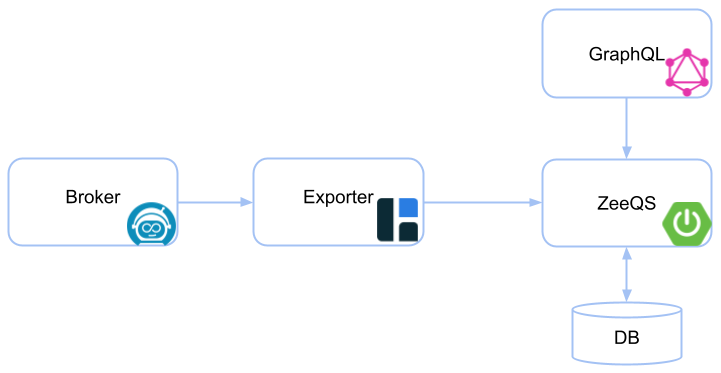

ZeeQS - Zeebe Query Service
=========================

[](https://github.com/camunda-community-hub/community)
[](https://github.com/Camunda-Community-Hub/community/blob/main/extension-lifecycle.md#stable-)
[](https://opensource.org/licenses/Apache-2.0)

[](https://github.com/camunda-community-hub/community/blob/main/extension-lifecycle.md#compatiblilty)

A [Zeebe](https://github.com/camunda/zeebe) community extension that provides a [GraphQL](https://graphql.org/) query
API over Zeebe's
data. The data is
imported from the broker using
the [Hazelcast exporter](https://github.com/camunda-community-hub/zeebe-hazelcast-exporter) and aggregated in the
service.



## :rocket: Install

### Docker

The docker image is published
to [GitHub Packages](https://github.com/orgs/camunda-community-hub/packages/container/package/zeeqs)
.

Run the following command to start the application:

```
docker run -p 9000:9000 ghcr.io/camunda-community-hub/zeeqs:latest
```

- Ensure that a Zeebe broker is running with
  a [Hazelcast exporter](https://github.com/camunda-community-hub/zeebe-hazelcast-exporter)
- Forward the Hazelcast port to the docker container (default: `5701`)
- Configure the connection to Hazelcast (default: `localhost:5701`)
    - `ZEEBE_CLIENT_WORKER_HAZELCAST_CONNECTION` (environment variable)
    - `zeebe.client.worker.hazelcast.connection` (application.yaml)

Or, if you run it on your local machine (Linux only):

```
docker run --network="host" ghcr.io/camunda-community-hub/zeeqs:latest
```

After the application is started, the GraphQL endpoint is available under `http://localhost:9000/graphql`.

Go to http://localhost:9000/graphiql and explore the GraphQL API using [GraphiQL](https://github.com/graphql/graphiql).

### Docker Compose

For a local setup, the repository contains a [docker-compose file](docker/docker-compose.yml). It
contains multiple profiles for different configurations.

Use an in-memory database (H2):

```
docker-compose --profile in-memory up
```

Use a PostgreSQL database:

```
docker-compose --profile postgres up
```

After the application is started, the GraphQL endpoint is available under `http://localhost:9000/graphql`.

Go to http://localhost:9000/graphiql and explore the GraphQL API using [GraphiQL](https://github.com/graphql/graphiql).

### Configuration

By default, the API endpoint is available under the port `9000`. And the database is only in-memory (i.e. not
persistent).

To configure the application, look at the [application.yml](app/src/main/resources/application.yml) and
the [docker-compose file](docker/docker-compose.yml).
See [here](https://docs.spring.io/spring-boot/docs/current/reference/html/spring-boot-features.html#boot-features-external-config)
on how to configure a Spring Boot application in general.

## :sparkles: Usage

The application provides a GraphQL endpoint under `/graphql`.

You can query the API via HTTP POST request and a JSON body containing the `query`.

For example:

```
curl \
  -X POST \
  -H "Content-Type: application/json" \
  --data '{ "query": "{ processes { nodes { key } } }" }' \
  http://localhost:9000/graphql
```

The best way to explore and inspect the GraphQL API is to use the integrated web-based tool [GraphiQL](https://github.com/graphql/graphiql). It is available
under http://localhost:9000/graphiql.

### Queries

The GraphQL API provides the following queries:

- [processes](graphql-api/src/main/resources/graphql/Process.graphqls)
- [processInstances](graphql-api/src/main/resources/graphql/ProcessInstance.graphqls)
- [jobs](graphql-api/src/main/resources/graphql/Job.graphqls)
- [userTasks](graphql-api/src/main/resources/graphql/UserTask.graphqls)
- [messages](graphql-api/src/main/resources/graphql/Message.graphqls)
- [incidents](graphql-api/src/main/resources/graphql/Incident.graphqls)
- [errors](graphql-api/src/main/resources/graphql/Error.graphqls)

<details>
  <summary>Example query</summary>
  <p>

Query all processes including their number of process instances:

```graphql
{
    processes {
        totalCount
        nodes {
            key
            bpmnProcessId
            version
            processInstances {
                totalCount
            }
        }
    }
}
```

Response:

```json
{
  "data": {
    "processes": {
      "totalCount": 3,
      "nodes": [
        {
          "key": "2251799813685249",
          "bpmnProcessId": "demo-process",
          "version": 1,
          "processInstances": {
            "totalCount": 3
          }
        },
        {
          "key": "2251799813685251",
          "bpmnProcessId": "demo-2",
          "version": 1,
          "processInstances": {
            "totalCount": 2
          }
        },
        {
          "key": "2251799813685269",
          "bpmnProcessId": "demo-3",
          "version": 1,
          "processInstances": {
            "totalCount": 1
          }
        }
      ]
    }
  }
}
```

  </p>
</details>

### Pagination

In order to limit the response size and the query processing, each list query uses pagination to return only a subset of
the data. By default, it returns the first 10 items of the list.

In addition to the items, the query result contains also the total count of the items.

```graphql
{
    processes(perPage: 10, page: 0) {
        totalCount
        nodes {
            key
        }
    }
}
```

### Filters

Some queries allow to filter the result by passing arguments in the query.

```graphql
{
    processInstances(stateIn: [ACTIVATED]) {
        nodes {
            key
        }
    }
}
```

### Subscriptions

The GraphQL API provides the following subscriptions:

- [processUpdates](graphql-api/src/main/resources/graphql/Process.graphqls)
- [processInstanceUpdates](graphql-api/src/main/resources/graphql/ProcessInstance.graphqls)

The subscriptions are exposed via WebSockets over the same endpoint `/graphql`.

<details>
  <summary>Example subscription</summary>
  <p>

Subscribe to any updates of process instances:

```graphql
subscription {
    processInstanceUpdates {
        processInstance {
            key
            state
        }
        updateType
    }
}
```

Response:

```json
{
  "data": {
    "processInstanceUpdates": {
      "processInstance": {
        "key": "2251799813685251",
        "state": "ACTIVATED"
      },
      "updateType": "ELEMENT_INSTANCE"
    }
  }
}
```

  </p>
</details>

## Build from Source

Build with Maven

`mvn clean install`

## Code of Conduct

This project adheres to the Contributor Covenant [Code of
Conduct](/CODE_OF_CONDUCT.md). By participating, you are expected to uphold
this code. Read more about
the [Camunda Community Code of Conduct](https://camunda.com/events/code-conduct/) and how to report
unacceptable behavior.

## License

[Apache License, Version 2.0](/LICENSE) 

